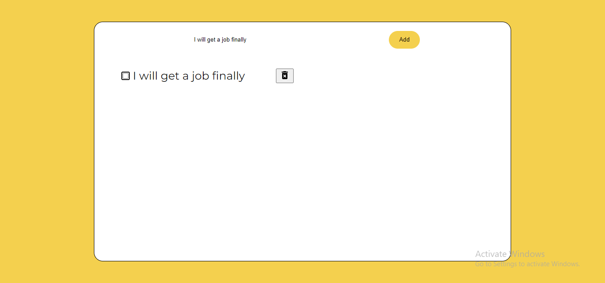

# ToDo List App

This is a simple ToDo list web application built using React, Redux, and Redux Thunk.

## Screenshot



## Features

- Add ToDo items
- Delete ToDo items

## Installation

1. Clone the repository:

   ```bash
   git clone https://github.com/MrUnAnonymous/to-do-list

1. Install dependencies:

    ```bash
    cd todo-list-app
    npm install

2. Start the development server:

    ```bash
    npm start

3. Open your web browser and go to `http://localhost:3000` to view the app.

## Usage

- Type the ToDo item into the input field and press Enter or click the "Add ToDo" button to add it to the list.
- Click the "Delete" button next to a ToDo item to remove it from the list.

## Technologies Used
- React
- Redux
- Redux Thunk
- Material Icons
